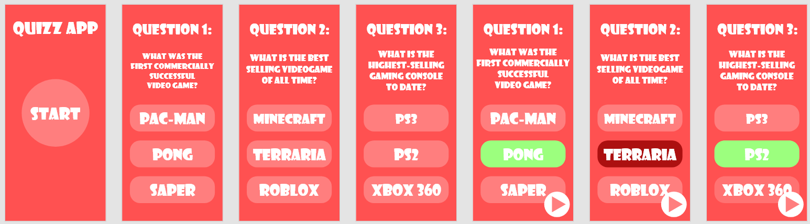

# Quiz App
Quiz game made in React with React-Router, Storybook, Context API and SASS. Quiz was designed in Adobe XD only for mobile devices.  
[View Demo](https://nilphym.github.io/Quiz-App)  
[Download Adobe XD Project](readme/QuizApp.xd)

## Table of content
* [Screenshots](#screenshots)
* [Technologies](#technologies)
* [Setup](#setup)
* [Contact](#contact)

## Screenshots

## Technologies
* [React](https://reactjs.org)
* [React-Router](https://reactrouter.com)
* [Sass](https://sass-lang.com)
* [Storybook](https://storybook.js.org)
* [Adobe XD](https://www.adobe.com/products/xd.html)

## Contact
Created by **Jędrzej Ratajczak** ([@nilphym](https://github.com/nilphym)) - feel free to contact me!
